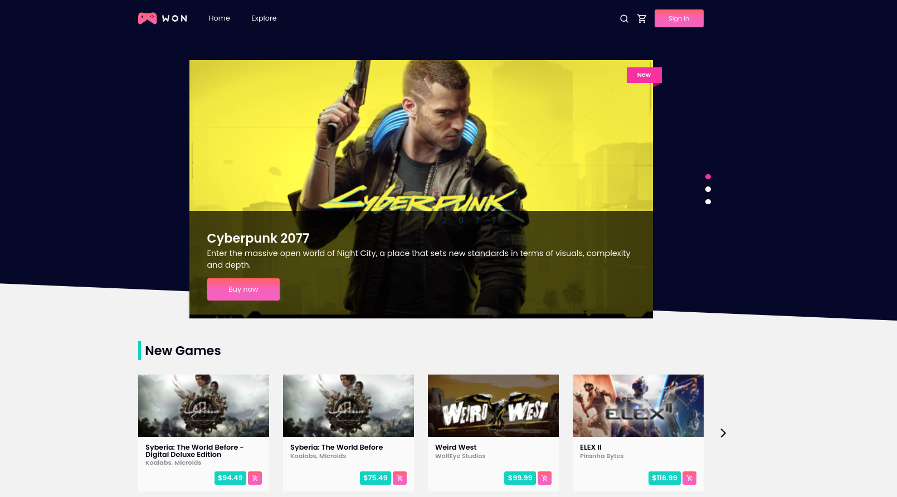
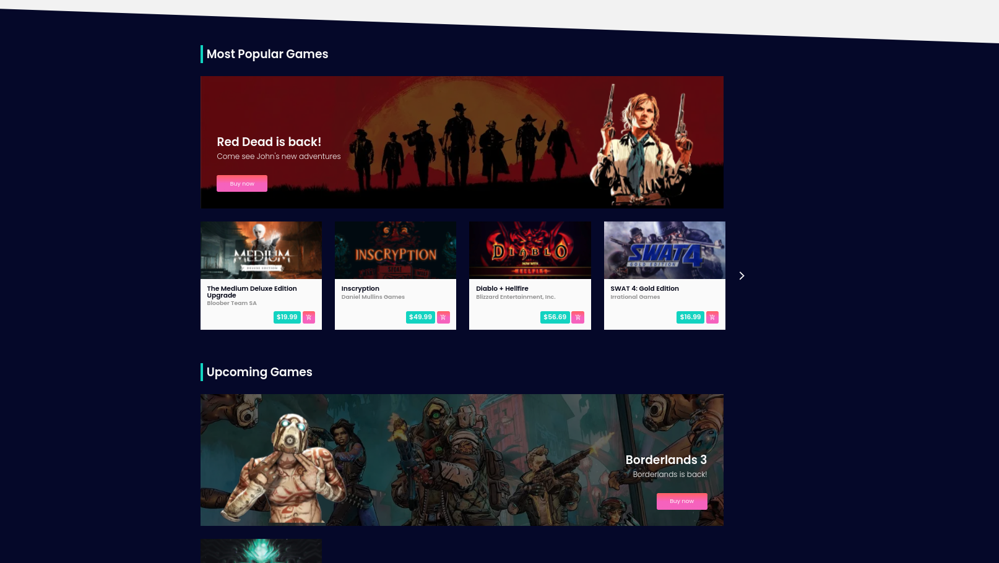
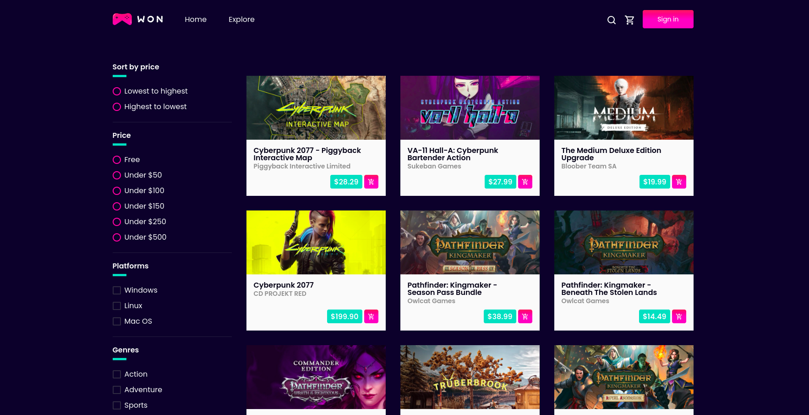
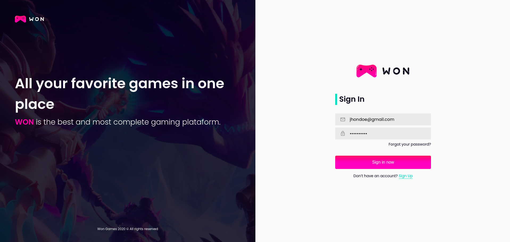
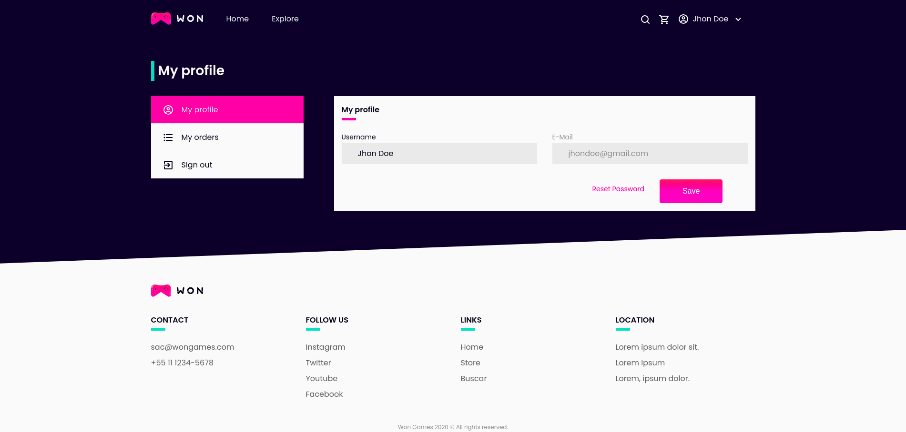
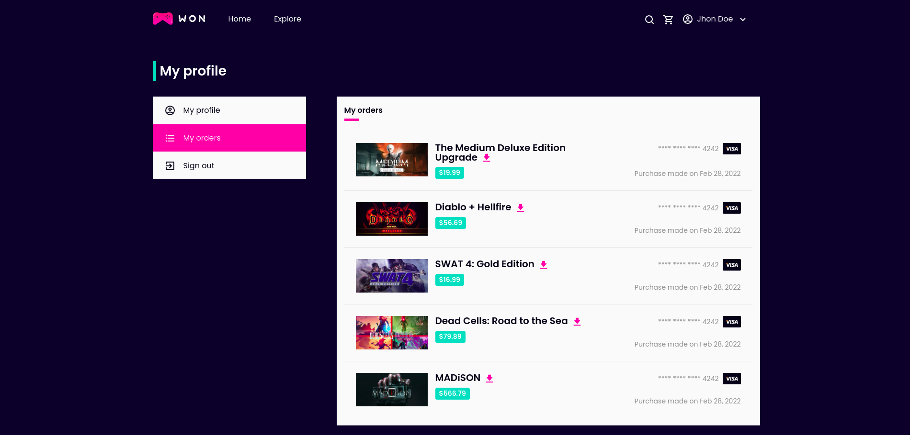
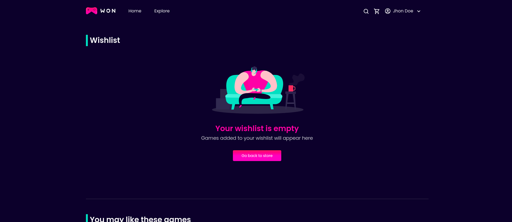

<div align="center" style="margin-bottom: 20px;">
  <h1>WONGAMES</h1>
  <p align="center">
    
    
    
    
    
    
  </p>

  

  

  
</div>

### About project
The wongames platform is an e-commerce for PC games, the system contains a PostgresSQL database, an API developed with Strapi and the front-end developed with NextJS, in addition to several other technologies such as NextAuth, GraphQL, unit tests with Jest and React Testing Library, and also has e2e tests with the Cypress tool.


### :zap: Main technologies
- [TypeScript](https://www.typescriptlang.org/docs/)
- [Strapi](https://strapi.io/)
- [NextJS](https://nextjs.org/)
- [Jest](https://jestjs.io/pt-BR/docs/getting-started)
- [React Testing Library](https://testing-library.com/docs/react-testing-library/intro/)
- [Cypress](https://www.cypress.io/)
- [Styled-Components](https://styled-components.com/)
- [Stripe](https://stripe.com/)
- [NextAuth](https://next-auth.js.org/)
- [Apollo GraphQL](https://www.apollographql.com/)

### :rocket: Repositories (source code)
- [DATABASE](https://github.com/jefferson1104/wonGames-database)
- [API](https://github.com/jefferson1104/wonGames-api)
- [CLIENT](https://github.com/jefferson1104/wonGames-client)


### :thinking: How to Contribute?

**Fork the back-end, front-end or mobile repository**

```bash
# clone your fork
$ git clone url-do-seu-fork

# Create a branch with your feature or bug fix
$ git checkout -b minha-branch

# Commit your changes
$ git commit -m 'feature/bugfix: minhas alterações'

# Push to your branch
$ git push origin minha-branch
```

Once your pull request has been merged, you can delete your branch.

### 🎨 Screenshots
<p align="center">
  
  
  
  
  
  
  
</p>
